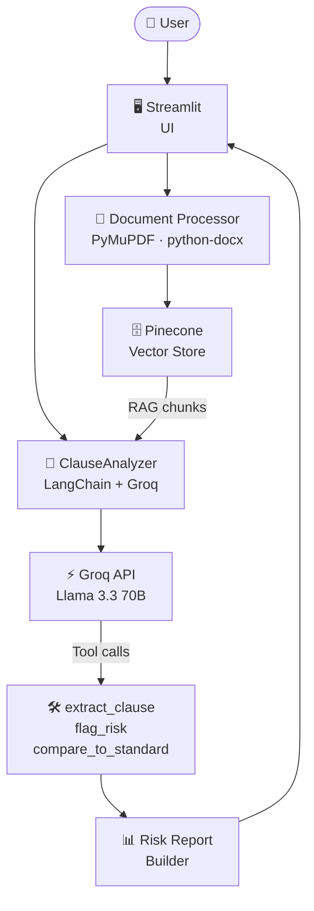
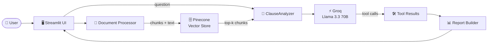

# ⚖️ ClauseGuard — Legal Contract Intelligence

[](https://clauseguardapp.streamlit.app)

> Upload any contract. Get a structured, jurisdiction-aware risk report — clause by clause — in under 90 seconds.

An AI-powered legal contract analysis platform that combines **RAG-based Q&A** with an **agentic tool-calling risk engine** inside a clean Streamlit interface. Upload a PDF, Word, or plain-text contract, select your jurisdiction (India or United States), and ClauseGuard extracts every clause, scores it against jurisdiction-specific legal standards, and flags risks with actionable recommendations.

---

## ✨ Features

- 🔍 **Clause-by-clause risk scoring** — every section extracted, scored 0–100, and categorised as Critical / High / Medium / Low / Standard
- ⚖️ **Jurisdiction-aware analysis** — separate legal frameworks for India (ICA 1872, Patents Act 1970, Gratuity Act 1972, Arbitration Act 1996) and United States (DTSA 2016, CA B&P Code 16600, FAA, CA Labor Code 2870)
- 💬 **Natural-language Q&A** — ask anything about the contract; answers are grounded in the actual document via RAG
- 📋 **Market standard comparison** — each key clause compared against jurisdiction-specific market norms (Favorable / Market Standard / Unfavorable / Highly Unfavorable / Missing)
- 🔁 **Complete coverage guarantee** — section pre-pass extracts all headings; gap-fill pass re-analyses any sections the model skipped
- 🔑 **No stored credentials** — API keys are entered per session and never persisted anywhere

---

## 🏗️ System Architecture



---

## 🤖 Tech Stack

| Component | Technology | Purpose |
|---|---|---|
| UI | Streamlit | Chat interface, risk report display, clause browser |
| LLM | Groq — `llama-3.3-70b-versatile` | Clause extraction, risk scoring, Q&A |
| LLM Client | LangChain Groq | Groq API integration + tool binding |
| Vector DB | Pinecone (serverless) | Semantic search over contract chunks |
| Embeddings | `BAAI/bge-small-en-v1.5` | 384-dim sentence embeddings via sentence-transformers |
| Orchestration | LangChain LCEL | Prompt chains, tool-use agentic loop |
| PDF Parsing | PyMuPDF | Extract text from PDF contracts |
| DOCX Parsing | python-docx | Extract text from Word contracts |

---

## 🔗 Component Flow



---

## ⚙️ How It Works

### Risk Analysis — Three-Pass Architecture

#### Pass 1 — Section Pre-pass
A fast single LLM call extracts every section heading from the contract. This produces a mandatory coverage list — the model is instructed to analyze every listed section without exception.

#### Pass 2 — Main Agentic Loop
The analyzer runs up to 35 tool-calling iterations. For each section it calls three tools in sequence:

| Tool | What It Does |
|---|---|
| `extract_clause` | Records the verbatim contract text and section reference |
| `flag_risk` | Assigns a risk level and 0–100 score using the calibration table |
| `compare_to_standard` | Compares the clause against jurisdiction-specific market norms |

#### Pass 3 — Gap-fill
After the main loop, any sections not covered are detected and sent to a second tool-use loop. Results are merged without overwriting existing data.

---

### Risk Scoring Calibration

| Band | Score | Meaning |
|---|---|---|
| Critical | 85–100 | Deal-breaker. Immediate legal exposure. Do not sign without changes. |
| High | 60–84 | Significant. Must negotiate before signing. |
| Medium | 35–59 | Common but worth negotiating if possible. |
| Low | 10–34 | Minor deviation from standard. |
| None | 0–9 | Acceptable, market-standard language. |

The overall contract score is a weighted aggregate: top score × 0.45 + second score × 0.30 + average of the rest × 0.25. If any clause is Critical, the overall score floors at 82.

---

### Jurisdiction-Specific Legal Frameworks

#### India
- **Non-Compete** — void post-employment under Section 27 ICA 1872 (*Niranjan Shankar Golikari v Century Spinning*)
- **IP Assignment** — Copyright Act 1957 S.17 (employer owns employment work); Patents Act 1970 (personal-time inventions)
- **Termination** — Payment of Gratuity Act 1972; Industrial Disputes Act 1947 S.25F; State Shops Acts
- **Arbitration** — Arbitration & Conciliation Act 1996 (Indian seat required; cost sharing is market standard)
- **Indemnification** — Sections 124–125 ICA; Section 74 limits to reasonable compensation

#### United States
- **Non-Compete** — California B&P Code 16600 (void in CA); state law elsewhere; FTC 2024 rule
- **IP Assignment** — CA Labor Code 2870 (personal-time carve-out mandatory); Copyright Act 1976
- **Arbitration** — Federal Arbitration Act; *Epic Systems v Lewis* SC 2018 (class action waivers upheld)
- **Trade Secrets** — Defend Trade Secrets Act 2016; Uniform Trade Secrets Act
- **Termination** — At-will doctrine; WARN Act (60 days for mass layoffs)

---

## 🚀 Getting Started

### Prerequisites

- Python 3.10+
- A free [Groq API key](https://console.groq.com)
- A free [Pinecone API key](https://app.pinecone.io)

### Run Locally

```bash
# Clone the repository
git clone https://github.com/vaibhavsimha-j/Clauseguard.git
cd Clauseguard

# Install dependencies
pip install -r requirements.txt

# Run the app
streamlit run app.py
```

Then open your browser at `http://localhost:8501` and enter your API keys in the sidebar.

---

## 💬 Usage Examples

### Risk Analysis

```
1. Enter your Groq and Pinecone API keys in the sidebar
2. Select jurisdiction: India or United States
3. Upload a PDF, Word, or plain-text contract
4. Click "Generate Risk Report"
5. Browse findings by risk level in the Risk Analysis and Clauses tabs
```

### Q&A

```
You:  What are the termination conditions?
AI:   Section 7.1 states the company may terminate with zero days notice...
      Under Indian law (Industrial Disputes Act 1947), this is non-compliant...

You:  Is there a non-compete clause? Can it be enforced?
AI:   Yes — Section 3.2 imposes a 3-year worldwide restriction.
      Under Section 27 of the Indian Contract Act 1872, this is void...
```

---

## 📁 Repository Structure

```
Clauseguard/
├── app.py                          # Streamlit UI — all pages and sidebar
├── backend/
│   ├── clause_analyzer.py          # LLM orchestration, tool-use loop, report builder
│   ├── document_processor.py       # PDF / DOCX / TXT parsing and chunking
│   └── vector_store.py             # Pinecone index management and similarity search
├── templates/
│   ├── __init__.py                 # Jurisdiction router
│   ├── standard_clauses_india.py   # Indian legal standards and score calibration
│   └── standard_clauses_us.py      # US legal standards and score calibration
├── requirements.txt
└── README.md
```

---

## 📦 Dependencies

```
langchain>=0.3.0
langchain-groq>=0.2.0
langchain-pinecone>=0.2.0
langchain-huggingface>=0.1.0
langchain-core>=0.3.0
pinecone>=4.0.0
sentence-transformers>=3.0.0
streamlit>=1.38.0
PyMuPDF>=1.23.0
python-docx>=1.1.0
python-dotenv>=1.0.0
```

---

## 🌟 Key Design Decisions

**Agentic tool-calling over prompt-and-parse**
Rather than asking the LLM to return a JSON blob and parsing it, ClauseGuard uses LangChain's native tool-calling loop. Each clause triggers three structured tool calls. This produces reliable, schema-validated output even for long contracts.

**Section pre-pass + gap-fill for complete coverage**
A single LLM call first extracts all section headings, which become a mandatory checklist. After the main loop, skipped sections are detected and sent to a second pass. This eliminates the common failure mode where the model stops after 5–6 clauses.

**Jurisdiction-as-prompt, not as code**
Legal standards are stored as structured text in `templates/`, not as hardcoded Python logic. Adding a new jurisdiction means adding one file — no code changes required.

**Pinecone over local vector stores**
Using a hosted vector DB means the contract index persists across sessions and is accessible in deployed environments without a local file system dependency.

**BAAI/bge-small-en-v1.5 embeddings**
Groq has no embeddings API. A compact 384-dim sentence-transformer model runs locally for fast, zero-cost embeddings without adding a second paid API dependency.

**Session-scoped credentials**
API keys are entered in the sidebar and bound to `@st.cache_resource` keyed by the key string. Keys are never written to disk, never logged, and are garbage-collected when the session ends.

---

## ⚠️ Limitations

- Contract text is **truncated at 50,000 characters** — very long contracts may have later sections skipped
- Risk analysis takes **30–90 seconds** depending on contract length (Groq rate limits + multiple tool-call rounds)
- Groq free tier has **rate limits** (~30 requests/minute) — analysis may fail under heavy load
- Legal analysis is **AI-generated** and should not substitute for advice from a qualified lawyer
- Pinecone free tier supports **one index** — all contracts share the `clauseguard` index, filtered by `contract_id`

---

## 🔑 API Keys

| Service | Purpose | Get Key |
|---|---|---|
| Groq | Serves `llama-3.3-70b-versatile` for clause analysis and Q&A | [console.groq.com](https://console.groq.com) |
| Pinecone | Hosts the contract vector index for semantic search | [app.pinecone.io](https://app.pinecone.io) |

Keys are entered via the sidebar and are **never stored** — they exist only within your active Streamlit session.

---

## 👨‍💻 Author

**[Vaibhav Simha J](https://www.linkedin.com/in/vaibhav-simha-j-0b46b5327/)**

📧 vaibhavsimhajworks@gmail.com

---

## 📄 License

This project was developed by [Vaibhav Simha J](https://www.linkedin.com/in/vaibhav-simha-j-0b46b5327/). Feel free to explore, learn from, and build upon this work with appropriate attribution.

---

*Jurisdiction-aware. Clause-by-clause. Agentic.*
*Upload a contract. Know your risks. Negotiate with confidence.*
